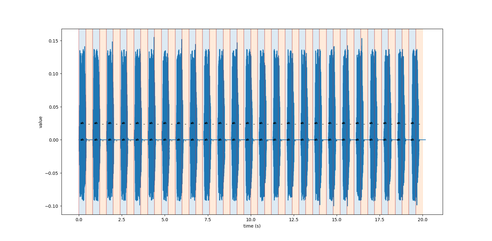
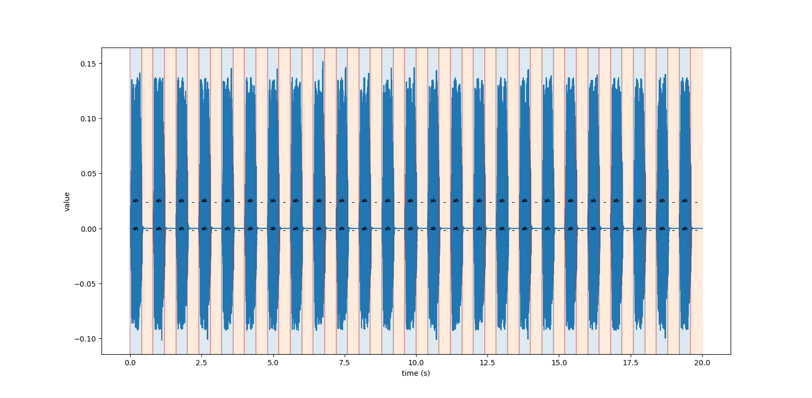
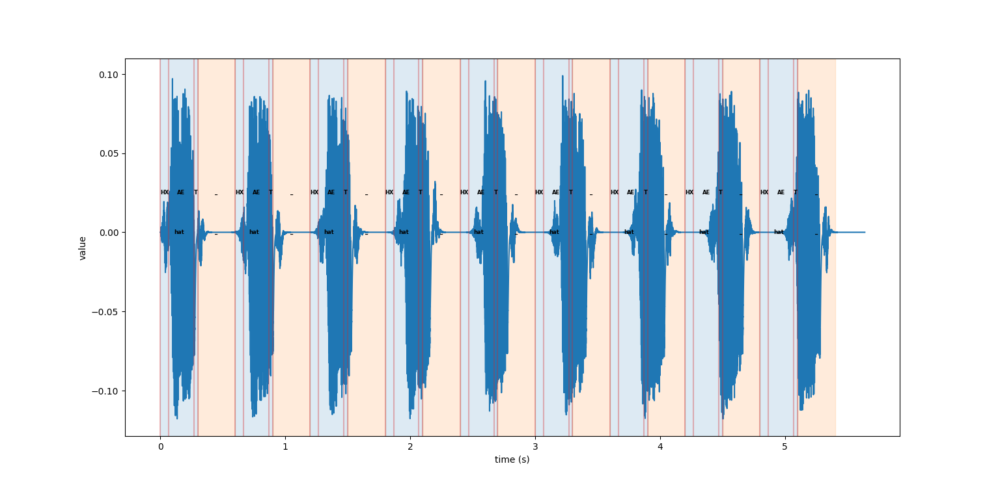

# How to Get DECTalk to Stay Time.


## DECTalk:

I am using a modified version of DECTalk to achieve accurate timing. 
As a base, I use the new vocal tract model with a sample rate of 10kHz, employing the following changes:
 - **Set the duration of a comma pause to zero** (this in the only change which improves timing accuracy).
- Changed `notetab[]` to use A4=440Hz tuning.
- Improved pitch correction (replacing the prior linear correction factor which is wrong).
- Expanded vocal range in `notetab[]` (from C2-C5 to A2-E5).

## TL;DR:

If you don't want to read about what all you need to account for, just see 
`reactive_clause_conscience_quantizer()` in [Quantizer.py](Quantizer.py).

## Objective

I want to programmatically provide an input to DECTalk such that it sings perfectly in time,
making it viable for musical applications. The main difficulty comes from taking floating point note durations and quantizing them into
DECTalk string input.

[//]: # (See [LocalTypes.py]&#40;LocalTypes.py&#41; for the structure of `Note`.)


## The Naive Approach
The naive approach is to just round the durations and provide that as input. 

```python
def naive_quantizer(notes: List[Note]) -> str:
    out_command = "["
    for note in notes:
        out_command += f"{note["phoneme"]}<{int(note["duration"])},{note["pitch"]}>"

    return out_command + "]"
```

I feel that is important to discuss why this does not work.

DECTalk produces audio in frames consisting of a fixed number of samples. This number depends on the sample rate, 
which in our case is 10kHz, meaning the frame size is 64 samples. 

This means that the output duration of each phoneme can only last a multiples of 
64 samples or 6.4ms. As a consequence of this, we can only guarantee 
timing accuracy within 3.2ms. 

When interpreting a duration `t` in milliseconds, DECTalk calculates the number of frames 
as `(10 * (t + 4)) // 64`. This means that if we input `ah<400,28>` ("ah" for 400ms), DECTalk
will sing for 63 frames or 403.2ms. This error is not insignificant and easily
accumulates into noticeable timing issues.

In this plot, we can see the output wav file falling out of time
with the beat lines:



## Reactive Error Approach

The first improvement to make is accounting for this error.
For each input duration, we can calculate the output duration. 
We can then account for this error in the next iteration.
This is the underlying method of my final approach.

```python
SAMPLES_PER_FRAME = 64
SAMPLE_RATE = 10_000

def reactive_error_quantizer(notes: List[Note]) -> str:
    acc_err: float = 0

    out_command = "["
    for note in notes:
        target_ms = note["duration"]

        # 
        input_ms = int(target_ms - acc_err)
        
        out_command += f"{note["phoneme"]}<{input_ms},{note["pitch"]}>"
        
        out_frames = ((input_ms + 4) * 10) // SAMPLES_PER_FRAME
        out_ms = 1_000 * (out_frames * SAMPLES_PER_FRAME) / SAMPLE_RATE
        
        acc_err += (out_ms - target_ms)
    
    return out_command + "]"
```

With this approach, the output lines up with the beats fairly well:
 


## Other things to account for

### Vowel-R Phonemes

When processing phonemic input, DECTalk will combine some groups of phonemes into a single
phoneme. For example, if you input, `iy r`, DECTalk will change it to `ir`. When doing this,
DECTalk discards the shorter phoneme. Being unaware of this can lead to a ton of headache (speaking form experience).

Fortunately, this is fairly easy to remedy: don't give these cases as input to DECTalk. There's a list
of how each vowel gets combined with `r` somewhere in DECTalk's code which should tell you what cases
to avoid. Alternatively, you can replace `r` phoneme with `rx`, which will not get combined.

### Dummy Vowel Insertion

When a plosive phoneme is followed by a silence, a "dummy vowel" is 
automatically inserted after the plosive. This dummy vowel has a fixed duration 
(depending on the language) of 4 frames. 

This means our relative error approach falls out of time when quantising words
that end with a plosive:
 

Because this duration is fixed, we can account for it easily (not really tho)

### Comma Insertion

DECTalk processes phonemes in clauses. Each clause is processed one at a time and passed into a buffer.
To prevent the buffer from overflowing, the code sets a maximum of 300 phonemes per clause.

If your input is longer than this limit, DECTalk will automatically insert a comma at the 298th phoneme.
This comma will cause the output to pause for a short time, which is undesirable. 

This is why I set the comma duration to zero when modifying DECTalk. This makes this stutter near nonexistent 
(the gain will fall to zero at the end of a clause; the output is still effected, just not the timing).

The code will also not insert dummy vowels if the clause already has the maximum number of phonemes. 
This makes accounting for dummy vowel insertion more difficult.


## Clause Conscientious Approach

This brings us to my current approach. In short, we split clauses by periodically adding
commas before silence phonemes, accounting for the extra frames this introduces.

In this approach, we keep track of the number of phonemes in the last clause. If this number is greater 
than an arbitrary threshold, then we insert a comma at the next silence phoneme.

To add a comma, we need to exit phonemic mode, add the comma, and reenter phonemic mode. When doing this, 
independently of the comma duration, the output pauses for 2 frames.

```python
COMMA_INSERTION_THRESHOLD = 100
COMMA_PAUSE_NUM_FRAMES = 2
DUMMY_VOWEL_NUM_FRAMES = 4
MIN_INPUT_MS = 5
FRAME_SIZE = 64
SAMPLE_RATE = 10_000


def fr_to_ms(fr: int) -> float:
    return 1_000 * (fr * FRAME_SIZE) / SAMPLE_RATE


def reactive_clause_conscience_quantizer(notes: List[Note]) -> str:
    accumulative_error: float = 0
    total_duration: float = 0
    num_phonemes_in_clause: int = 0
    out_command: str = "["

    for i in range(len(notes)):
        note = notes[i]
        extra_frames = 0
        add_comma = False
        target_ms = note["duration"]

        num_phonemes_in_clause += 1
        # account for extra dummy vowel phoneme
        if note["phoneme"] in PLOSIVES:
            num_phonemes_in_clause += 1

        # account for duration added by the dummy vowel
        if i + 1 < len(notes) and note["phoneme"] in PLOSIVES and notes[i + 1]["phoneme"] == "_":
            extra_frames += DUMMY_VOWEL_NUM_FRAMES

        # add a comma to ensure that a dummy vowel can always be inserted
        if note["phoneme"] == "_" and num_phonemes_in_clause > COMMA_INSERTION_THRESHOLD:
            add_comma = True
            extra_frames += COMMA_PAUSE_NUM_FRAMES
            num_phonemes_in_clause = 0

        input_ms = int(target_ms - accumulative_error - fr_to_ms(extra_frames))

        if input_ms < MIN_INPUT_MS:
            input_ms = MIN_INPUT_MS

        out_frames = ((input_ms + 4) * 10) // FRAME_SIZE

        # don't add pitch for silence phoneme
        if note["phoneme"] == "_":
            out_command += f"{note["phoneme"]}<{input_ms}>"
        else:
            out_command += f"{note["phoneme"]}<{input_ms},{note["pitch"]}>"

        if add_comma:
            out_command += "],["

        out_frames += extra_frames
        out_ms = fr_to_ms(out_frames)

        total_duration += out_ms

        accumulative_error += (out_ms - target_ms)

    return out_command + "]"
```

### Result

I find that this approach is reliable enough to use for musical applications.


[//]: # (![sandman_naive]&#40;images/mrsandman_naive.png&#41; )
[//]: # (![sandman_smart]&#40;images/mrsandman_smart.png&#41; )